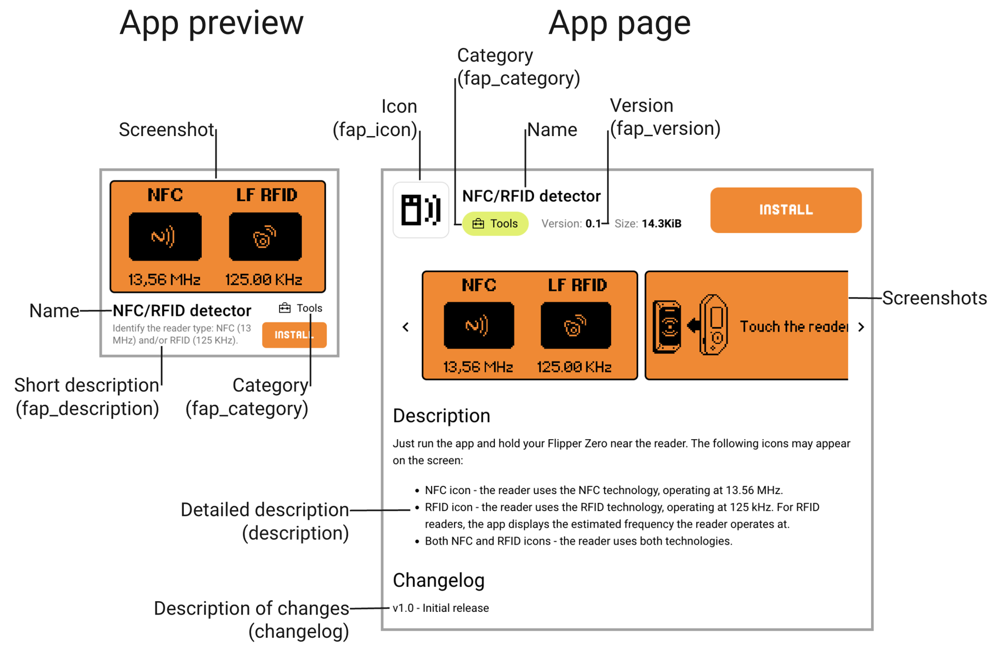

# Apps Catalog: Contribution Guide

Thank you for your interest in contributing to the Flipper Apps Catalog, a place where people can discover, download, and share community developed apps for Flipper Zero.

In this guide, you will learn how to use this repository to publish and update your apps in the Apps Catalog.

## General terms and requirements

 1. **Open Source License**. Apps submitted to this repository must be licensed under an Open Source License of your choice, permitting building and distribution of the app in binary form by the Flipper Apps Catalog's infrastructure.
 2. **No infringement on rights or trademarks**. Apps and data they produce or process must not infringe on any third-party rights or trademarks.
 3. **No malicious code**. Submitted apps must not contain any malicious code or code that may cause harm to the user's device or data.
 4. **Compliance with UGC Policies**. Apps must comply with the User-Generated Content Policies of [Play Store](https://support.google.com/googleplay/android-developer/answer/9876937) and [App Store](https://developer.apple.com/app-store/review/guidelines/#user-generated-content). We reserve the right to reject and remove apps that do not comply with these policies.
 5. **App metadata or source code updates**. If any changes to the app metadata or source code are required, we will contact the app author, as specified in the submitted pull request or using the contact information provided in the manifest file. If we do not receive a response within 14 days, the app will be removed from the Catalog.
 6. **Emergency app updates**. If immediate changes are required to address a security vulnerability, copyright or any other critical issue, we reserve the right to unpublish the app from the Catalog before contacting the author.
 7. **Reserved right to unpublish apps**. We reserve the right to reject and unpublish apps that do not comply with these terms and requirements, or for any other reason at any time.

## Publishing your app to the Apps Catalog

The Flipper Apps Catalog repository doesn't host the app source code. It **only hosts** `manifest.yml` files with a link to the app source code repository and the app metadata.

> [!NOTE]  
> The app source code must be hosted in a public Git repository. We currently only accept apps hosted on GitHub.

To publish your app to the Apps Catalog:
1. Prepare the app source code repository
2. Prepare metadata files and fill in the metadata fields
3. Create a pull request with the Apps Catalog Manifest file `manifest.yml` file in the Apps Catalog repository
4. Wait until your pull request is approved and merged

Below, we discuss each step in more detail. 

### Step 1. Preparing the app source code repository

 1. Ensure your app is buildable with [uFBT](https://pypi.org/project/ufbt/) and compatible with the latest Release or Release Candidate firmware version.
 2. Add an app icon to the repository (10x10px 1-bit .png file).
 3. Add app screenshots to the repository (take them using qFlipper and do not change their resolution or format). These screenshots will be displayed in the Apps Catalog, and the first screenshot will be shown in the App preview.
 4. Create a Markdown-formatted file `README.md` with additional information about your app. There, you can include instructions on how to use the app, necessary hardware add-ons, etc. This information will be displayed in the detailed description on the app page in the Apps Catalog.
 5. Create a Markdown-formatted file `changelog.md`. In it, describe changes with each new version of the app in the following format:
 
```
v0.2:
added images

v0.1:
added changelog
```

### Step 2. Preparing metadata files

1. Create `application.fam` (in your app's source code repo). You need to edit this manifest to specify several fields, such as `appid` (must be unique), `name`, `fap_category`, `fap_version`, etc. See [Flipper App Manifests (.fam)](https://developer.flipper.net/flipperzero/doxygen/app_manifests.html) for details and examples.
2. Commit the `application.fam` to your repository.
3. Create `manifest.yml` (you later need to add it to the Apps Catalog repo via pull request, see step 3). Fill in text files in it, including paths to additional files. In the `commit_sha` field of manifest.yml, specify commit ID from the source repository (after committing all files to the source repository). See [Manifest](./Manifest.md) for details and an [example](../example/manifest.yml).

> [!NOTE]  
> Please make sure your `manifest.yml` is valid as described [here](Manifest.md#validating-manifest).

Info from these fields will later be shown in the Apps Catalog after your app is published. Here is what it's going to look like in the catalog interface:

<p align="center"></p>

### Step 3. Sending the pull request with manifest.yml to the Apps Catalog

 1. Fork this repository and clone your fork to the local path.
 2. Create a new branch. The recommended naming scheme for your branch is the following: `<username>/<appid>_<appversion>`, where `username` is your GitHub username, `appid` is your app ID, and `appversion` is your app's version.
 3. In the new branch, add your `manifest.yml` file to the directory: `applications/<category>/<application-id>/`. Before adding it, remember to check its validity as described [here](./Manifest.md#validating-manifest).
 4. Optionally, you can add a markdown-formatted `README.md` file with additional information about your app to the same directory. It will open when a user clicks on the `Manifest` link on the app page in the Apps Catalog. 
 5. Create a pull request from your local branch, filling in the pull request template.

To learn more about contributing and forking on GitHub, see [Contributing to projects](https://docs.github.com/en/get-started/quickstart/contributing-to-projects).

### Step 4. App moderation

Once you submit your pull request, it will be moderated. Check out your GitHub notifications to follow the review process. If you receive any error notifications, please go to your PR page and find the review step that caused the issue for more details. If everything is formatted correctly and your app runs without errors, we'll usually accept your pull request within 1-2 business days.

In a few minutes after your pull request is accepted, your app will be available in the Apps Catalog in [mobile apps](https://flpr.app/?ref=blog.flipper.net) and in [Flipper Lab](https://lab.flipper.net/apps).

## Updating your app

Updating an app is done in the same way as publishing your app to the Apps Catalog. Note that each submission must have a unique version. If you want to update an app, increment the version number in the `application.fam` file in the source code repo. See [Manifest format description](./Manifest.md#app-version) for details.
